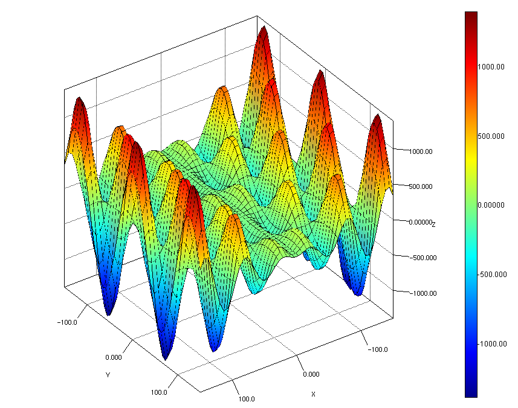

Project to demonstrate the [JZY3D](http://jzy3d.org)
scientific plotting library. Ported from [Scala version](https://github.com/retronym/jzy3d-demo).

```bash
gradle run -DmainClass=org.jzy3d.demos.surface.BuildSurfaceDemo
gradle run -DmainClass=org.jzy3d.demos.surface.ColorWaveDemo
gradle run -DmainClass=org.jzy3d.demos.surface.MexicanDemo
gradle run -DmainClass=org.jzy3d.demos.surface.WireSurfaceDemo
```

Example:


[Troubleshooting](http://jzy3d.org/troubleshooting.php)

